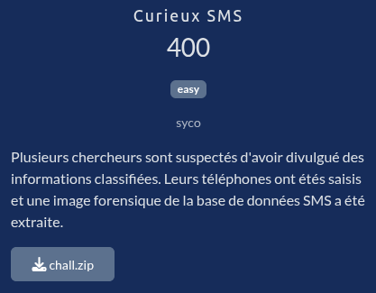

# Curieux SMS

## Fichiers du challenge

* **chall.zip** : fichier original du challenge (non modifié)

## Solution

Cliquez pour dévoiler la solution

* On est face à 3 extractions de bases de données d'un système android (fichiers mmssms.db).
* Il suffit d'explorer les différentes tables attentivement pour trouver les fragements du flag les uns après les autres.
* J'ai pour cela utilisé [SQLite Browser](https://sqlitebrowser.org/), un outil graphique pour explorer les bases de données SQLite.
* Voici les fragments du flag à trouver :
    * `404CTF{m4r13_` dans le fichier n°1, table `sms`, dans un des messages
    * `cur13_` dans le fichier n°2, table `conversations`, colonne `snippet`
    * `r4d1um_` dans le fichier joint 62 (image), dont l'existence est indiquée dans la table `part` du fichier n°3
    * `1898}` dans la table `threads` du fichier n°3, dans la colonne `snippet`

### Flag

`404CTF{m4r13_cur13_r4d1um_1898}`

