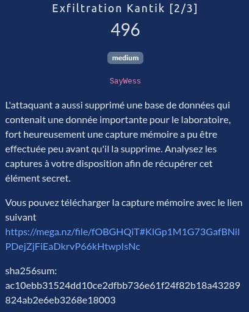
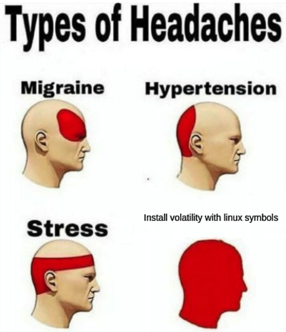

# Exfiltration Kantik [2/3]



## Fichiers du challenge

* **memory_dump.lime** (2 Go) : fichier original du challenge (non modifié)
    * [Lien Mega du propriétaire du challenge](https://mega.nz/file/fOBGHQiT#KlGp1M1G73GafBNilPDejZjFiEaDkrvP66kHtwpIsNc)
    * [Miroir (copie sur Mega)](https://mega.nz/file/ZMoyjRAb#KlGp1M1G73GafBNilPDejZjFiEaDkrvP66kHtwpIsNc)
    * Vous pouvez vérifier l'intégrité du fichier avec :
        ```bash
        sha256sum -c SHA256SUMS
        ```

## Début de solution

<details>
<summary>Cliquez pour dévoiler la solution</summary>

### Préambule

Ce challenge consiste à analyser un dump mémoire (outil LIME). A cette fin, l'outil de référence est **Volatility**.

Je n'ai pas réussi à résoudre ce challenge, j'ai cependant jugé bon de publier la procédure d'installation de volatility et de création du profil, qui peut être utile pour d'autres challenges forensiques similaires.

### Installer volatility

<details>
<summary>Cliquez pour les instructions d'installation</summary>

J'utilise à cette fin conda afin de séparer les environnements et éviter les conflits de dépendances. Voici les étapes à suivre pour installer volatility avec conda :

```bash
# Installation de conda (si ce n'est pas déjà fait)
cd
mkdir -p miniconda3
wget https://repo.anaconda.com/miniconda/Miniconda3-latest-Linux-x86_64.sh -O miniconda3/miniconda.sh
bash miniconda3/miniconda.sh -b -u -p miniconda3
source miniconda3/bin/activate
conda init
source ~/.bashrc
conda --version

# prereq
sudo apt update
sudo apt install -y build-essential git libpcre3-dev libyara-dev libsnappy-dev

conda create -n vol3 python=3.10
conda activate vol3

# volatility 3
git clone https://github.com/volatilityfoundation/volatility3.git
cd volatility3
pip install -e ".[full]"
```

</details>

### Création du fichier ISF (profil de l'image)

* Volatility 3 utilise des fichiers ISF (fichiers json) qui décrivent la structure de la mémoire du noyau.
* Il n'existe pas de fichier ISF Linux universel qui fonctionne pour toutes les versions du noyau.
    * Cela est dû au fait que la structure de la mémoire change entre les versions du noyau
* Nous allons donc devoir en créer un pour la version du noyau spécifique du dump.



* A cette fin, l'outil de référence est **dwarf2json**.
* Il nécessite le fichier **vmlinux** correspondant à la version du noyau du dump.
    * En résumé, vmlinux est le binaire compilé statiquement du noyau Linux, qui contient toutes les informations nécessaires pour comprendre la structure de la mémoire du noyau.
* Plusieurs choix dans ce cas :
    * Compiler le noyau de la version spécifique du dump à partir des sources puis récupérer le vmlinux
    * Télécharger une image de la même version du noyau et extraire le vmlinux
    * Enfin, vérifier si un fichier profil n'existe pas déjà en ligne (ce qui était au final le cas ici).
        * A cette fin, le repo suivant est la référence : https://github.com/Abyss-W4tcher/volatility3-symbols/
* Après un essai infructueux de la première méthode (que j'avais déjà suivie pour un précédent CTF), j'ai opté pour la seconde.

#### Identification de la version du noyau

La commande suivante nous donne la version du noyau utilisée dans le dump :

```bash
$ ./vol.py -f $DUMPFILE banners.Banners
Volatility 3 Framework 2.28.1
Progress:  100.00		PDB scanning finished                  
Offset	Banner

0xb7cb0d0	Linux version 6.1.0-44-amd64 (debian-kernel@lists.debian.org) (gcc-12 (Debian 12.2.0-14+deb12u1) 12.2.0, GNU ld (GNU Binutils for Debian) 2.40) #1 SMP PREEMPT_DYNAMIC Debian 6.1.164-1 (2026-03-09)
[...]
```

#### Téléchargement de l'image du noyau

* En cherchant bêtement sur Google, on trouve le fichier qui nous intéresse : http://security.debian.org/debian-security/pool/updates/main/l/linux/linux-image-6.1.0-44-amd64-dbg_6.1.164-1_amd64.deb
* On peut ensuite extraire le fichier vmlinux à partir de ce .deb :
    ```bash
    mkdir extract
    dpkg-deb -x linux-image-6.1.0-44-amd64-dbg_6.1.164-1_amd64.deb extract
    find extract -name "vmlinux*" # # <= le fichier est ici : extract/usr/lib/debug/boot/vmlinux-6.1.0-44-amd64
    cp extract/usr/lib/debug/boot/vmlinux-6.1.0-44-amd64 ./vmlinux
    ```

#### Installation de dwarf2json

```bash
cd
sudo apt install -y golang
git clone https://github.com/volatilityfoundation/dwarf2json
cd dwarf2json
go build
sudo mv dwarf2json /usr/local/bin/
```

#### Création du fichier ISF et installation du profil dans volatility

* On peut enfin créer le fichier ISF à partir du vmlinux :
    ```bash
    dwarf2json linux --elf vmlinux > linux-6.1-debian.json
    ```
* A des fins de compatibilité, on modifie la bannière pour être sûr de faire matcher :
    ```bash
    nano linux-6.1-debian.json
    ```
* Chercher `constant_data`, c'est une longue chaîne en base64.
* La remplacer par la bannière du dump encodée en base64 :
    ```
    TGludXggdmVyc2lvbiA2LjEuMC00NC1hbWQ2NCAoZGViaWFuLWtlcm5lbEBsaXN0cy5kZWJpYW4ub3JnKSAoZ2NjLTEyIChEZWJpYW4gMTIuMi4wLTE0K2RlYjEydTEpIDEyLjIuMCwgR05VIGxkIChHTlUgQmludXRpbHMgZm9yIERlYmlhbikgMi40MCkgIzEgU01QIFBSRUVNUFRfRFlOQU1JQyBEZWJpYW4gNi4xLjE2NC0xICgyMDI2LTAzLTA5KQ==
    ```
* Dernière étape, placer le fichier au bon endroit pour que volatility puisse le trouver :
    ```bash
    mkdir -p ~/volatility3/volatility3/framework/symbols # attention à changer le chemin si votre installation de volatility est ailleurs, j'ai git clone dans mon home ici
    cp linux-6.1-debian.json ~/volatility3/volatility3/framework/symbols/
    ```

</details>