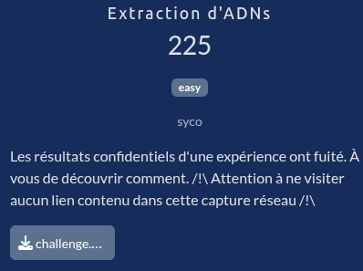
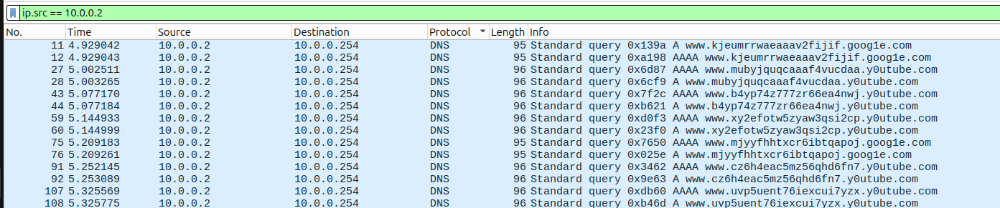
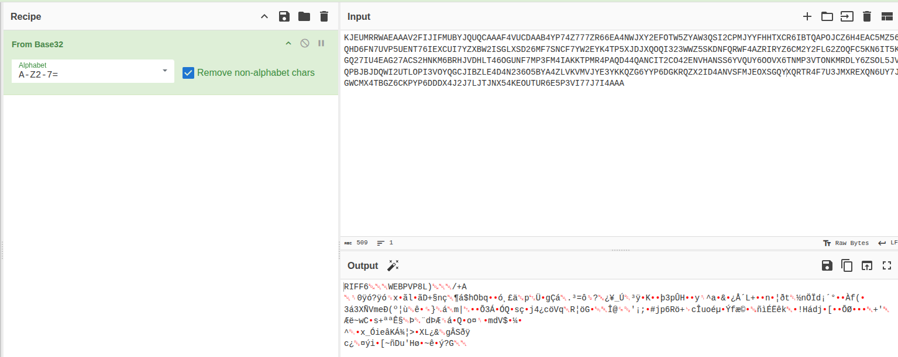
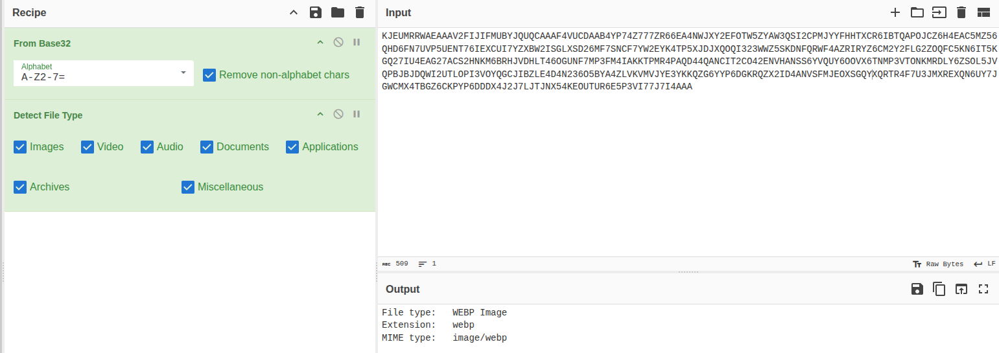
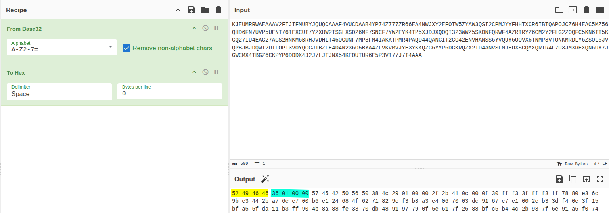
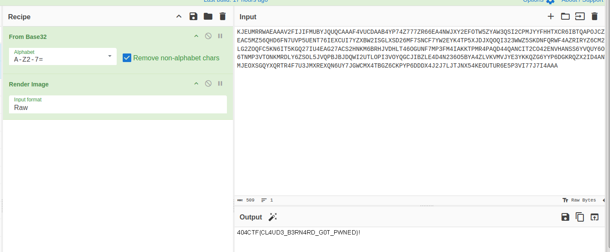

# Extraction d'ADNs




## Fichiers du challenge

* **challenge.pcap** : fichier original du challenge (non modifié)

>[!CAUTION]
> Comme indiqué dans l'énoncé, attention à ne pas visiter les liens présents dans le fichier pcap, ils sont potentiellement malveillants. J'ai pour ma part travaillé dans une VM jetable déconnectée d'internet.

## Solution

<details>
<summary>Cliquez pour dévoiler la solution</summary>

* En explorant le fichier pcap, on comprend assez vite qu'on est face à une exfiltration via DNS.
* Commençons par isoler les paquets intéressants : on met un filtre sur `10.0.0.2` (IP qui envoie les requêtes DNS) et on trie par protocole.<br>
    
* On extrait l'ensemble des requêtes en CSV : sélectionner les paquets puis `Fichier > Exporter analyse des paquets > Au format CSV`. Bien cocher "Paquet sélectionné" avant de valider !
* On crée un script Python pour extraire les données et les assembler :
    ```python
    import csv


    csvfile = open('packets.csv', newline='')
    reader = csv.reader(csvfile)

    data_list = list()
    for row in reader:
        info = row[-1] # last column
        
        space_splitted = info.split(' ')
        if len(space_splitted) < 2: # skip first item "Info"
            continue
        
        dns_query = space_splitted[-1]

        dns_parts = dns_query.split('.')
        actual_data = dns_parts[1]

        if actual_data not in data_list:
            data_list.append(actual_data)

    csvfile.close()


    # Reassemble data
    print(''.join(data_list).upper())
    ```
    * Explication du `.upper()` à venir.
* La première problématique consiste à trouver l'algorithme d'encodage des données. En essayant dans tous les sens avec CyberChef, on ne trouve rien de concluant.
* On prend le parti de regarder "l'alphabet" (tous les caractères utilisés dans la chaîne de données) :
    ```python
    >>> ''.join(sorted(set("KJEU[...]7I4AAA")))
    '234567ABCDEFGHIJKLMNOPQRSTUVWXYZ'
    ```
* C'est caractéristique d'un encodage en base32 !
* On tente dans CyberChef :<br>
    
    * D'où le `.upper()` dans le script : les noms de domaine sont insensibles à la casse, mais CyberChef demande des majuscules. On aurait pu également changer le champs "Alphabet" dans CyberChef pour accepter les minuscules.
* Ça ressemble à première vue à du binaire, mais le "WEBP" attire notre attention. Vérifions :<br>
    
* Bingo ! On pourrait également valider en transformant en hexadécimal :<br>
    
    * On trouve [sur ce site](https://www.garykessler.net/library/file_sigs_GCK_latest.html) la signature correspondant à du WebP, ça match.
        ```
        52 49 46 46 xx xx xx xx
        57 45 42 50 	  	RIFF....
        WEBP
        WEBP 	  	Google WebP image file, where xx xx xx xx is the file size
        ```
    * Bonus : la taille du fichier est de 0x0136 (car en little-endian) soit autour de 310 octets.
* On peut alors afficher l'image :<br>
    


### Flag

`404CTF{CL4UD3_B3RN4RD_G0T_PWNED}`

</details>