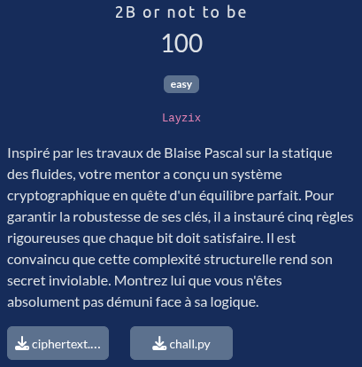

# 2B or not to be



## Fichiers du challenge

* **chall.py** : fichier original du challenge (non modifié)
* **ciphertext.txt** : fichier original du challenge (non modifié)
* **solve.py** : script de résolution du challenge

## Solution

<details>
<summary>Cliquez pour dévoiler la solution</summary>

* On est face à un chiffremet XOR avec une clé de 16 octets (128 bits).
* On nous donne le flag chiffré, et on sait que les bits de la clé vérifient 5 conditions (E1 à E5).

### Récupération du début de la clé

* D'après les propriétés de XOR : $\forall x, x \oplus x = 0$.
    * En effet, $0 \oplus 0 = 0$ et $1 \oplus 1 = 0$.
    * Pour rappel, XOR est défini comme suit :

        | a | b | a XOR b |
        |---|---|---------|
        | 0 | 0 |    0    |
        | 0 | 1 |    1    |
        | 1 | 0 |    1    |
        | 1 | 1 |    0    |

* En notant le flag $m$, le flag chiffré $c$ et la clé $k$, on a : $c = m \oplus k$.
* D'où : $c \oplus m = (m \oplus k) \oplus m = k \oplus (m \oplus m) = k \oplus 0 = k$ ($\oplus$ est associatif et commutatif).
* En d'autres termes, connaissant le début du flag, on peut récupérer le début de la clé.
* Attention cependant, comme la taille de la clé est inférieure à celle du flag, on ne peut pas récupérer la fin de celle-ci de cette manière.
* Après implémentation en Python, nous voilà avec le début de la clé :
    ```python
    Deduced from flag prefix:
    10110010101100101011001010110010101100101011001010110010XXXXXXXXXXXXXXXXXXXXXXXXXXXXXXXXXXXXXXXXXXXXXXXXXXXXXXXXXXXXXXXXXXXXXXXX
    ```

### Explication des contraintes sur la clé

* Attaquons nous désormais aux contraintes sur la clé... Vous auez besoin de ceci.<br>
    
* Traduisons les différentes contraintes. On notera $b_i$ le $i$ -ème bit de la clé (en partant de 0).
    * E1 : les bits par paquets de 4 successifs contiennent un ou trois 1.
    * E2 : $\forall i \in [0, 32], b_i \neq b_{4i} \implies b_{2i+2} = 1$.
    * E3 : les bits par paquets de 3 contiennent **au moins** un 1.
    * E4 : les bits par paquets de 8 contiennent **exactement** quatre 1.
    * E5 : $\forall i \in [0, 64], b_i \oplus b_{127-i} = 1$.

### Utilisation de E5

* Très clairement, E5 est ici notre meilleur pivot. En effet, en découle : $b_{127-i} = 1 \oplus b_i$.
* On applique donc E5 :
    ```python
    After E5:
    10110010101100101011001010110010101100101011001010110010XXXXXXXXXXXXXXXX10110010101100101011001010110010101100101011001010110010
    ```

### Utilisation de E2

* On peut par la suite appliquer E2, qui est la plus simple à implémenter.
* Voici le résultat :
    ```python
    After E2:
    101100101011001010110010101100101011001010110010101100101X1XXXXXXXXXXXXX10110010101100101011001010110010101100101011001010110010
    ```
* ... youpi, on a gratté deux bits de plus.

### BRUTE-FORCE

* Par simplicité, on entreprend de brute-forcer les bits restants, en vérifiant les contraintes à chaque fois.
* On commence avec le filtre de candidats suivants :
    ```python
    def is_good_flag_candidate(flag_candidate: bytes) -> bool:
        return flag_candidate.startswith(b"404CTF{") \
            and flag_candidate.endswith(b"}")
    ```
* On tombe cependant sur des candidats avec des caractères non-ascii... Ajustons notre filtre :
    ```python
    def is_good_flag_candidate(flag_candidate: bytes) -> bool:
        return flag_candidate.startswith(b"404CTF{") \
            and flag_candidate.endswith(b"}") \
            and all(32 <= b < 127 for b in flag_candidate)
    ```
* On a encore beaucoup (beaucoup) trop de candidats. En limitant l'execution à $2 \times 10^4$ essais :
    ```
    [i] Brute-forcing the remaining bits...
    [...]
    [i] Total candidates found: 2152
    ```
* Limitons à un charset probable :
    ```python
    FLAG_CHARSET = b"0123456789ABCDEFGHIJKLMNOPQRSTUVWXYZabcdefghijklmnopqrstuvwxyz{}_"
    def is_good_flag_candidate(flag_candidate: bytes) -> bool:
        return flag_candidate.startswith(b"404CTF{") \
            and flag_candidate.endswith(b"}") \
            and all(b in FLAG_CHARSET for b in flag_candidate)
    ```
* 0 candidats... Essayons d'ajouter le caractère `$` au charset :
    ```
    [i] Brute-forcing the remaining bits...
    [+] Flag candidate found : 404CTF{N4mEt1Me$_2_mUC4B5s_70O_MuCh}
    [...]
    [+] Flag candidate found : 404CTF{YUmEt1Me$_2_mUC4UTs_70O_MuCh}
    [+] Flag candidate found : 404CTF{YumEt1Me$_2_mUC4Uts_70O_MuCh}
    [i] Total candidates found: 927
    ```
* C'est déjà mieux, mais toujours bien trop.
* On va devoir ruser. On remarque que le début du flag ressemble à `sometimes`en Leet Speak. Ajustons notre filtre :
    ```python
    def is_good_flag_candidate(flag_candidate: bytes) -> bool:
        real_start_ind = len('404CTF{')

        return flag_candidate.startswith(b"404CTF{") \
            and flag_candidate.endswith(b"}") \
            and all(b in FLAG_CHARSET for b in flag_candidate) \
            and flag_candidate[real_start_ind] in b'sS5' and flag_candidate[real_start_ind + 1] in b'oO0'
    ```
* Et là, bingo :
    ```
    [i] Brute-forcing the remaining bits...
    [+] Flag candidate found : 404CTF{S0mEt1Me$_2_mUC4_1s_70O_MuCh}
    [i] Total candidates found: 1
    ```
* Note : ici, j'ai eu de la chance. On peut trouver jusqu'à 3 candidats, cependant il n'y en a qu'un qui fait vraiement sens en Leet Speak.
    ```
    [+] Flag candidate found : 404CTF{S0mEt1Me$_2_mUC4_1s_70O_MuCh}
    [+] Flag candidate found : 404CTF{SOmEt1Me$_2_mUC4_Ns_70O_MuCh}
    [+] Flag candidate found : 404CTF{SomEt1Me$_2_mUC4_ns_70O_MuCh}
    [i] Total candidates found: 3
    ```


### Flag

`404CTF{S0mEt1Me$_2_mUC4_1s_70O_MuCh}`

</details>
