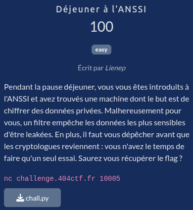

# Déjeuner à l'ANSSI



## Fichiers du challenge

* **chall.py** : fichier original du challenge (non modifié)

## Solution

<details>
<summary>Cliquez pour dévoiler la solution</summary>

* Un challenge sur RSA, où l'on peut déchiffrer un message, qui ne doit cependant pas contenir le flag !

### Théorie

* L'idée ici est d'exploiter la propriété "d'homomorphisme" de RSA sur les puissances.
* Rappel très rapide sur RSA :
    * Chiffrement : $$enc(M) = M^e \mod N = C$$
    * Déchiffrement : $$dec(C) = C^d \mod N = M$$
* On a donc en conséquence : $$C^2 = (M^e)^2 = (M^2)^e \mod N = enc(M^2)$$
* Il vient alors naturellement que : $$dec(C^2) = M^2 \mod N$$
* On passera ainsi le filtre de vérification, pas de trace du flag dans le cleartext produit.
* Attention cependant au modulo $N$ ! On notera $dec(C^2) = M^2 \mod N = M'$. On a alors deux cas possibles :
    * Si $M^2 < N$, alors $M' = M^2$ et en conséquence $M = \sqrt{M'}$
    * Sinon, on devra rajouter $kN$ à $M'$ et trouver $k$ afin d'obtenir un carré parfait, et ainsi récupérer $M$ : $M = \sqrt{M^2 + kN}$.
    * Pour déterminer le cas dans lequel on se trouve, on vérifie si $\lfloor \sqrt{M'} \rfloor^2 = M'$. Si c'est le cas, alors $M^2 < N$, sinon on est dans le second cas.

### Mise en œuvre

```
$ nc challenge.404ctf.fr 10005                                                                                                     (base) 
[INFO] Bienvenue dans le système interne de récupération des données. Voici les paramètres publiques :
{'n': 27556126240986779559933873428987616694482471053568109013278313957353949397088377888426395093040135229715567015926508703800008097406756879006350620166938120140145887560226405941824089544013012965022805213088222798287774782131031799819750919052154672719060465729475569813357725357752993292964936512894587033719290219126007633772907269811085352256939608403402276981435444520170948380433902128104470040329861808616773490017919764861743409449295656949124921630937228318037893652656763927734407112186328654323881805563299020858634911559461120255213942561940117011999657645207068391928074962022294098382941479271121673693213, 'e': 65537, 'encrypted_flag': 14576316069079438073826432456579710745551560166968180862483869920744454093249526869635706850819481379596938947166385116510305315159983874158159131246594321688357638248425977525219176564101180384530027159261872209923392193172064041411986954492654868728293583410863471519612180231058115174907176448761603362401397156827571141467602773584708261511665286839271220752110224447180065194300314404368560620882545040419117210335940851663656610706099455041579222053025569273761478538635263721497200284959797632687840429187052167252099432822609002960290294217394631606421052358596865221048691321693494517481822295008757950851739}
[SAISIE] Veuillez entrer un message à déchiffrer :
> 212468990145703441705019581875145218772824040849933629445426444273515191828289611604173083542117213043324765566584155317659974494970796568615578395932175283415320961885792803476433895436133154288824009114527978962499207547567456938310972476067744818725411023264526113536092331527451713731687878601478985534313780228921346694758895027093833860892229096032694517402264149252229870185261472081339787727779692812237160940525415695840353402551279255769228243911251063070897907868217338035926627757945862097666739838236372946022817235168494143968742455528355696493917721107842219965635554572949121289805203625627996836063730967377522236031527228077642858370641511799409934626033186338087481870496441747996484140841639635457165956865091761690451572236491371597923241176923606893167287078862161723539263429632248033367188661460929179717536128132832167199908439432778925219199476092141209781839091123694217339549695049642958687425653916983265624079529008306878936842988610297108909158639229307845101113828540391870311419922017198678832848163846730446051827122968674942658391880230874160808839111236296481000817621003352882625631242228815762013784172560785149097461223193737815632502339082186464077099429873617529787966881145131475875559324121
[SUCCÈS] Voici le résulat du calcul :
10278833474109711620333000094462478242456390801130804574025601043762695876962825071380954909466123336705040532154037760957554793503424585806274226383090173929779508942977801
```

2nd terminal :
```python
>>> c = 1457631606907943807382643245657971074555156016696818086248386992074445409324952686963570685081948137959693894716638511651030531515998387415815913\
124659432168835763824842597752521917656410118038453002715926187220992339219317206404141198695449265486872829358341086347151961218023105811517490717644876\
160336240139715682757114146760277358470826151166528683927122075211022444718006519430031440436856062088254504041911721033594085166365661070609945504157922\
205302556927376147853863526372149720028495979763268784042918705216725209943282260900296029029421739463160642105235859686522104869132169349451748182229500\
8757950851739
>>> c ** 2
212468990145703441705019581875145218772824040849933629445426444273515191828289611604173083542117213043324765566584155317659974494970796568615578395932175283415320961885792803476433895436133154288824009114527978962499207547567456938310972476067744818725411023264526113536092331527451713731687878601478985534313780228921346694758895027093833860892229096032694517402264149252229870185261472081339787727779692812237160940525415695840353402551279255769228243911251063070897907868217338035926627757945862097666739838236372946022817235168494143968742455528355696493917721107842219965635554572949121289805203625627996836063730967377522236031527228077642858370641511799409934626033186338087481870496441747996484140841639635457165956865091761690451572236491371597923241176923606893167287078862161723539263429632248033367188661460929179717536128132832167199908439432778925219199476092141209781839091123694217339549695049642958687425653916983265624079529008306878936842988610297108909158639229307845101113828540391870311419922017198678832848163846730446051827122968674942658391880230874160808839111236296481000817621003352882625631242228815762013784172560785149097461223193737815632502339082186464077099429873617529787966881145131475875559324121
>>> 
>>> m_2 = 10278833474109711620333000094462478242456390801130804574025601043762695876962825071380954909466123336705040532154037760957554793503424585806274\
226383090173929779508942977801
>>> from math import isqrt
>>> isqrt(m_2) * isqrt(m_2) == m_2
True
>>> hex_m = hex(isqrt(m_2))[2:]
>>> len(hex_m) % 2
0
>>> bytes.fromhex(hex_m).decode()
'404CTF{Luncht1m3_4tt4ck_b35t_4tt4ck}'
```

### Flag

`404CTF{Luncht1m3_4tt4ck_b35t_4tt4ck}`

</details>
