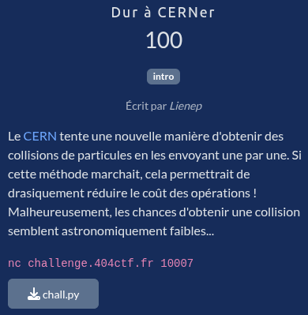
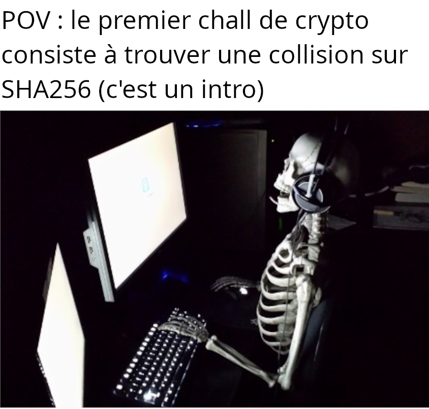

# Dur à CERNer

## Fichiers du challenge

* **chall.py** : fichier original du challenge (non modifié)
* **solve.py** : résolution du challenge

## Solution

Cliquez pour dévoiler la solution

* A première lecture, le challenge se résume à... Trouver une collision sur SHA 256. 
    
* Décortiquons le code :
    * On nous demande d'entrer deux "particules" = chaînes hexa (pas d'autre contrainte).
    * Le programme vérifie que les deux chaînes sont différentes (stay tuned)
    * Il convertit ensuite chaque particule en octets, puis calcule le SHA 256 de chacune d'elles.
    * Enfin, il compare les deux hash et affiche un message de victoire s'ils sont égaux.
* On commence par chercher s'il existe des séquences d'octets triviales qui produisent le même sha256. Turns out, il n'en existe pas, et c'est un problème toujours ouvert en cryptographie.
    * Et tant mieux, car la sécurité de *litéralement la majorité de l'ensemble de nos infrastructures numériques* en dépend.
* On se penche alors sur le test qui nous bloque : la vérification que les particules sont différentes.
* Si on arrive à trouver deux particules (chaînes en hexa) différentes qui produisent la même séquence d'octets, on a gagné.
* On teste tout bêtement avec un espace (strip inclus dans la conversion en octets ?)... Ça marche !
* Il suffit donc de soumettre (par exemple) : `01` et `01 ` (notez l'espace à la fin de la deuxième chaîne) pour valider le challenge.

### Flag

`404CTF{P4rt1cl35_g0_brrrrrrrrr!}`

