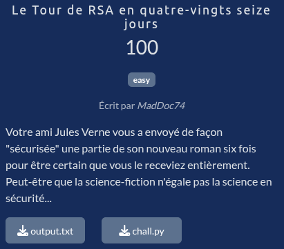

# Le Tour de RSA en quatre-vingts seize jours



## Fichiers du challenge

* **chall.py** : fichier original du challenge (non modifié)
* **output.txt** : fichier original du challenge (non modifié)
* **solve.py** : script de résolution du challenge
* **output.py** : fichier faisant partie de la solution (**spoil alert**)
* **archive/** : dossier contenant une archive de la page web utilisée pour la résolution du challenge (**spoil alert**)

## Solution

<details>
<summary>Cliquez pour dévoiler la solution</summary>

### Analyse du challenge

* On est face à un challenge RSA, où on nous fournit 6 paires de clés publiques (n, e) et de chiffrés c.
* Le point important ici est la génération des clés : en effet, par deux, on a :
    * $n_1 = pq_1$
    * $n_2 = pq_2$
* Ce qui est une faille majeure ! En effet, trivialement :
    $p = gcd(n_1, n_2)$
* Et ainsi :
    * $q_1 = n_1 // p$
    * $q_2 = n_2 // p$
* On peut donc récupérer très facilement $d$ et déchiffrer les messages ? Eh non, ce serait trop facile...

### La désillusion

* On essaie trivialement :
    * $\phi_1 = lcm(p - 1, q_1 - 1)$
    * $\phi_2 = lcm(p - 1, q_2 - 1)$
    * $d_1 = e^{-1} \mod \phi_1$
    * $d_2 = e^{-1} \mod \phi_2$
* Et on mange des ValueError à cause de $gcd(e, \phi) \neq 1$... En effet, $e = 96$ et $gcd(96, \phi) \neq 1$ pour les six paires de clés !

### La solution

* Après une rapide recherche, on tombe sur [cet article](https://medium.com/@g2f1/bad-rsa-keys-3157bc57528e) [[archive.ph](https://archive.ph/7DzrG)] [[archive locale](archive/RSA_%20e%20not%20coprime%20with%20the%20euler%20totient%20function%20_%20Medium.pdf)] qui semble traiter exactement de notre cas !
* On traduit les deux algorithmes présentés dans l'article en Python, et on les applique à nos six paires de clés.
* On lance le [script de résolution](solve.py) :
    ```python
    $ python3 solve.py                                                                  (base) 


    ^

    D'immenses forêts de lataniers, d'arecs, [...] de fougères arborescentes, couvraient le pays en premier plan, et en arrière se profilait l'élégante silhouette d'un flag : 404CTF{96_jours_cest_vraiment_trop_long_et_surtout_pas_premier}
    ```
* Bingo !

### Flag

`404CTF{96_jours_cest_vraiment_trop_long_et_surtout_pas_premier}`

</details>
