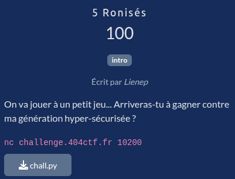

# 5 Ronisés

## Fichiers du challenge

* **chall.py** : fichier original du challenge (non modifié)
* **solve.py** : résolution du challenge
* **server.py** : simulation du serveur pour tester la solution en local

## Solution

Cliquez pour dévoiler la solution

* On est ici en présence d'un challenge de type crypto / loterie avec un générateur aléatoire très peu sécurisé (basé sur le timestamp d'exécution).
* On n'a même pas besoin de reverse la fonction de génération du secret, il suffit d'anticiper le future secret en générant à $t + k$ (où $k$ est un nombre de secondes) et de soumettre la réponse dès que le timestamp est atteint.
* Il faut pour cela tester avec quelques exécutions pour déterminer le temps de génération du secret (ici, ~1 seconde) et adapter la valeur de $k$. Par sécurité, on choisit ici $k = 5$ secondes.
* On rajoute la gestion de la connexion avec le serveur, on teste en local, et le challenge est résolu !

### Flag

`404CTF{J0l1_T1m1ng!}`

