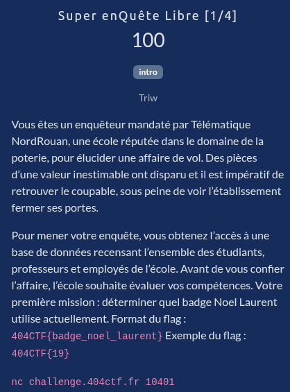

# Super enQuête Libre [1/4]



## Solution

<details>
<summary>Cliquez pour dévoiler la solution</summary>

* On a accès à une interface de type "shell" qui nous permet d'exécuter des requêtes SQL sur une base de données.
* Voici globalement les requêtes pour trouver le flag :

```sql
╔══════════════════════════════════════════════════════╗
║         404CTF — Super Enquête Libre                 ║
║         Base de données chargée                      ║
║  Tapez .help pour l'aide, .quit pour quitter         ║
╚══════════════════════════════════════════════════════╝

sql> .help

Commandes spéciales :
  .help           Affiche cette aide
  .tables         Liste les tables disponibles
  .schema [TABLE] Affiche le schéma d'une table (ou toutes)
  .quit / .exit   Quitte le shell

sql> .tables
  AccessLog   Attendance   Badge   Building   Course   Person   Room   sqlite_sequence
sql> select * from Badge; 
+----------+-----------+------------+-------------+--------+
| badge_id | person_id | issue_date | expiry_date | active |
+----------+-----------+------------+-------------+--------+
| 1        | 160       | 2021-01-17 | 2022-01-17  | 0      |
| 2        | 106       | 2021-01-29 | 2022-01-29  | 0      |
[...]
| 30       | 98        | 2022-01-25 | 2023-01-25  | 0      |
+----------+-----------+------------+-------------+--------+
  30 ligne(s)
  (affichage limité à 30 lignes sur 312)
sql> select * from Person;
+-----------+-----------+------------+------------+----------------------------+---------+-------+
| person_id | last_name | first_name | birth_date | email                      | status  | class |
+-----------+-----------+------------+------------+----------------------------+---------+-------+
| 1         | Durand    | Alice      | 2003-09-15 | alice.durand@campus.fr     | student | G1    |
| 2         | Simon     | Baptiste   | 2003-08-11 | baptiste.simon@campus.fr   | student | G5    |
[...]
+-----------+-----------+------------+------------+----------------------------+---------+-------+
  30 ligne(s)
  (affichage limité à 30 lignes sur 223)
sql> select person_id,last_name,first_name from Person where last_name="Noel"; 
+-----------+-----------+------------+
| person_id | last_name | first_name |
+-----------+-----------+------------+
| 17        | Noel      | Quentin    |
| 38        | Noel      | Laurent    |
| 59        | Noel      | Jade       |
| 80        | Noel      | Julien     |
| 101       | Noel      | Élodie     |
| 122       | Noel      | Boris      |
| 143       | Noel      | Camille    |
| 164       | Noel      | Xavier     |
| 185       | Noel      | Thibault   |
+-----------+-----------+------------+
  9 ligne(s)
sql> select badge_id from Badge where person_id=38;
+----------+
| badge_id |
+----------+
| 56       |
| 165      |
+----------+
  2 ligne(s)
sql> .exit
Au revoir.
```

### Flag

`404CTF{165}` (2e coup !)

</details>
