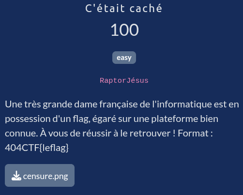
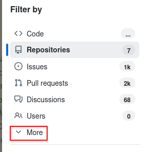
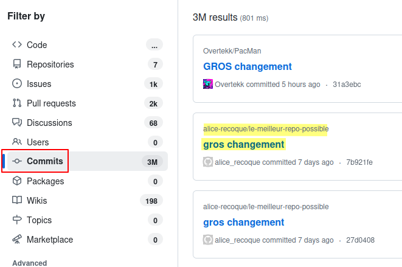
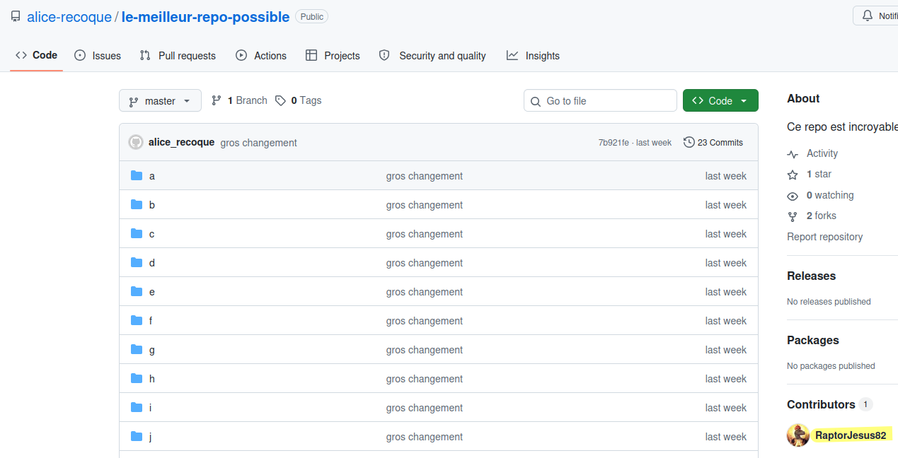
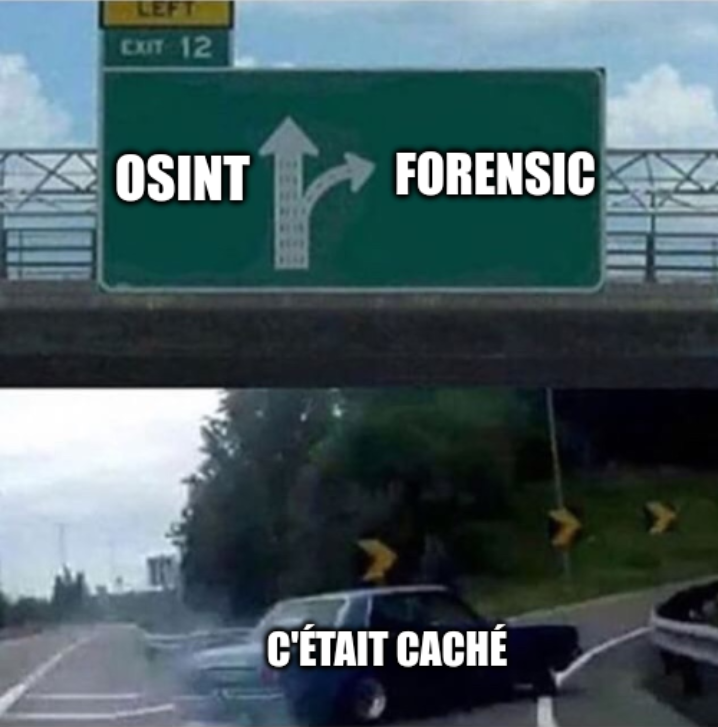

# C'était caché



## Fichiers du challenge

* **censure.png** : fichier original du challenge (non modifié)


## Solution

<details>
<summary>Cliquez pour dévoiler la solution</summary>

### Analyse de l'image

On distingue des indices bien en évidences :
* Des logos de **GitHub**
* Une partie de l'URL qui fait deviner `alice-reco[...]`
* On y distingue également ce qui ressemble à `[...]lleur-repo-pos[...]`
* Enfin, on devine des messages de commit, qui sont partiellement lisibles : `gros changement`

### A la recherche du repo GitHub

* On commence avec du Google Dorking : `site:github.com inurl:alice-reco`, mais le repo ne semble pas encore indexé.
* On décide alors de chercher directement sur GitHub.
    * Par nom d'utilisateur : `alice-reco` => pas concluant
    * Par intitulé de commit : `gros changement` => bingo : https://github.com/alice-recoque/le-meilleur-repo-possible<br>
        
        
        
* Pas trop de doute ici !

### Ça part en commandes git



* J'ai décidé de cloner le repo et d'utiliser git pour chercher le flag efficacement (ce qui **n'est pas une bonne pratique en termes d'OPSEC**, voir section suivante).
    ```bash
    $ git clone https://github.com/alice-recoque/le-meilleur-repo-possible
    $ cd le-meilleur-repo-possible
    ```
* On commence évidemment à coup de grep et de find, sans succès.
* Cherchons les commits ou le nombre d’occurrences de "404CTF" varie :
    ```bash
    $ git log -S 404CTF
    commit a7394c2afed06d5a3015e971813c57b34a36226c
    Author: alice_recoque <alice-recoque@proton.me>
    Date:   Thu May 21 21:21:32 2026 +0200

        gros changement

    commit d12c5e08b84cfd0623fc70b3653af4a61f0525f4
    Author: alice_recoque <alice-recoque@proton.me>
    Date:   Thu May 21 20:42:48 2026 +0200

        gros changement
    ```
* On essaie de revenir au premier commit retourné :
    ```bash
    $ git revert a7394c2afed06d5a3015e971813c57b34a36226c
    CONFLICT (rename/delete): S/T/K/FLAG.TXT renamed to s/t/k/flag.txt in HEAD, but deleted in parent of a7394c2 (gros changement).
    Auto-merging s/t/k/flag.txt
    CONFLICT (add/add): Merge conflict in s/t/k/flag.txt
    error: could not revert a7394c2... gros changement
    hint: After resolving the conflicts, mark them with
    hint: "git add/rm <pathspec>", then run
    hint: "git revert --continue".
    hint: You can instead skip this commit with "git revert --skip".
    hint: To abort and get back to the state before "git revert",
    hint: run "git revert --abort".
    hint: Disable this message with "git config advice.mergeConflict false"
    ```
* On tente alors de chercher le flag :
    ```bash
    ~/le-meilleur-repo-possible (master|REVERTING|●1✚1) [1]$ grep -ira "404CTF" .
    ./s/t/k/flag.txt:404CTF{CENSURÉ}
    ./s/t/k/flag.txt:404CTF{PLuT0T_FriTE5_0û_P0T@T03S?}
    ```

### Flag

`404CTF{PLuT0T_FriTE5_0û_P0T@T03S?}`

### Annexe : autocritique, bad OPSEC 💀


* Cloner un repo est visible dans l'interface **Insights** de GitHub, ce qui peut alerter la cible sur le fait que quelqu'un s'intéresse à son repo (si le repo n'est pas supposé être cloné).
    * Cela n'est cependant visible que sur une fenêtre de temps limitée, et aucune autre information n'est révélée (pas d'IP, pas de timestamp précis, etc).
* Cela contrevient à la règle d'or en OSINT : **ne jamais interagir avec la cible**.
    * C'est une réflexion que je me suis faite après coup.
* Nous sommes ici dans le cadre d'un CTF, dans une situation réelle, il aurait été préférable de ne pas cloner le repo, et de se contenter de chercher les informations via l'interface web de GitHub.

</details>
