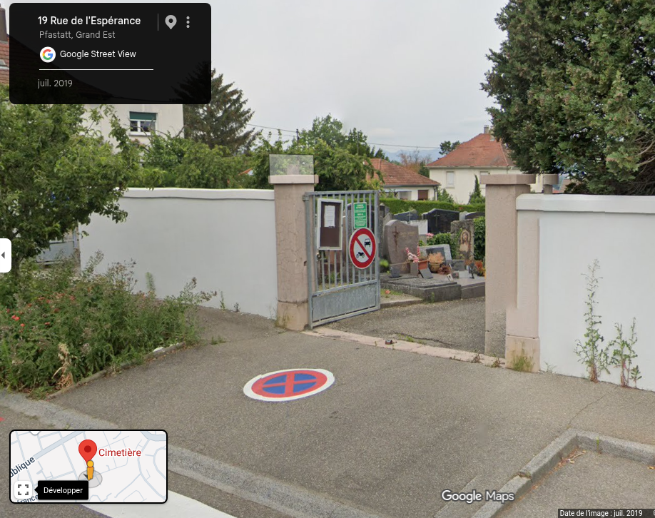

# Chaud Devant

Derrière une mort spectaculaire se cache parfois une grande scientifique...
Une fois que vous l'aurez retrouvée, un petit voyage en ligne vous permettra d'en savoir plus sur elle.
Dans l'ordre, il vous faudra retrouver :

* L'année de décès
* le mont où elle est décédée,
* son nom de famille,
* son jour de naissance
* et le mois de naissance de son mari.

Format du flag : `404CTF{2026_Everest_Curie_01_01}`

## Fichiers du challenge

* **cimetiere.jpeg** : fichier original du challenge (non modifié)

## Solution

Cliquez pour dévoiler la solution

### Pistes

* On fait une bête recherche inversée par image, on tombe sur le cimetière de **Pfastatt**, Département du Haut-Rhin, Alsace, France
  * https://www.findagrave.com/cemetery/2801783/cimeti%C3%A8re
* On vérifie sur maps : 
    
* Bingo !
* On essaie un pivot sur le mont mentionné dans l'énoncé (google Dork) :
   * `"scientifique" "Pfastatt" "mont"`
* On tombe directement sur cette page Wikipédia :
   * https://fr.wikipedia.org/wiki/Katia_et_Maurice_Krafft
* On vérifie sur le site trouvé précédemment si cela correspond, en cherchant le nom de Krafft :
   * https://www.findagrave.com/memorial/269972038/maurice-paul-krafft
* On a donc l'ensemble des informations entre la page wikipédia et la page findagrave :
   * L'année de décès : **1991**
   * le mont où elle est décédée : **Unzen**
   * son nom de famille : **Krafft** (et non le nom de naissance)
   * son jour de naissance : **17**
   * et le mois de naissance de son mari : **mars** (findagrave)

### Flag

`404CTF{1991_Unzen_Krafft_17_03}`

