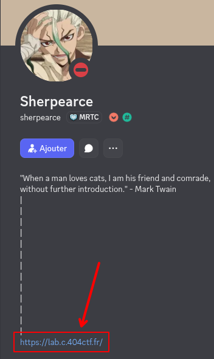
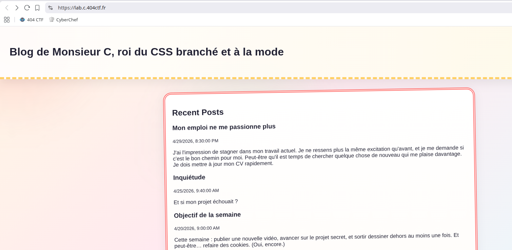

# Monsieur C : Découverte

*Écrit par Sherpearce*

Un étrange personnage se présentant comme "Monsieur C" est venu me voir en DM pour faire de la pub pour son nouveau blog en partageant son URL. Il était si sympathique que je n'ai pu refuser et ai mis son URL dans le premier endroit que j'avais sous les yeux. Quel est l'URL du blog ?

Format du flag : `404CTF{blog.404ctf.fr}`

Monsieur C est un pseudonyme fictif qui ne sert qu'à cacher le pseudo réel de la cible, merci de ne pas interagir avec des comptes manifestement actifs depuis longtemps et qui n'ont aucun lien avec le CTF :)

## Solution

Cliquez pour dévoiler la solution

### Pistes

* Après un paquet de recherches (Google Dork, différents réseaux sociaux, pastebin...), rien.
* Les termes “DM” et la notion de “premier endroit que j'avais sous les yeux” nous donne une idée. Non, il n'oserait pas...
* On retrouve sur discord le créateur du challenge, Sherpearce.
* Regardons son profil : 
   
* Allons visiter ce lien bien mystérieux : 
   
* Ah bah si, c'était aussi simple que ça.

### Flag

`404CTF{lab.c.404ctf.fr}`

