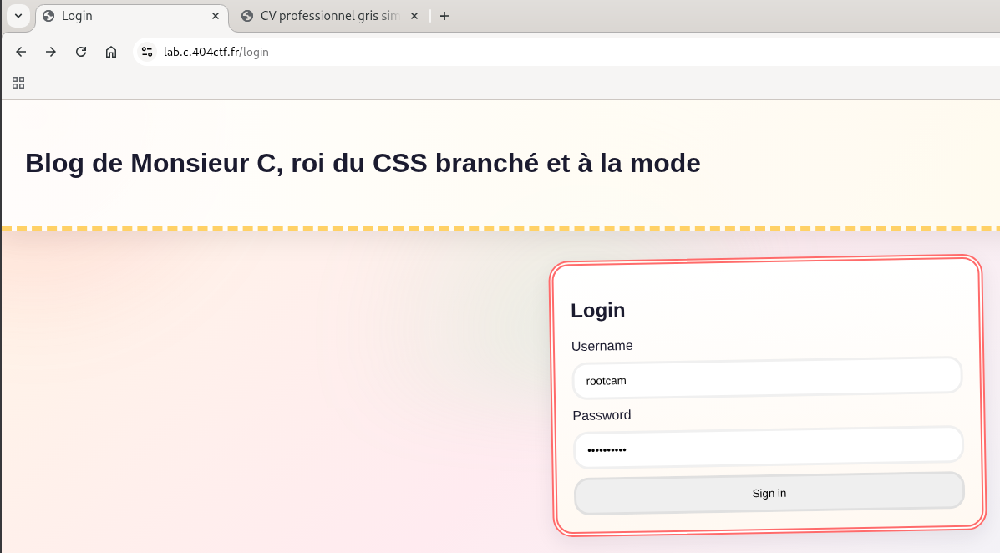
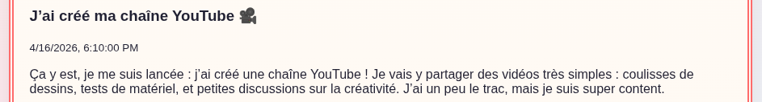
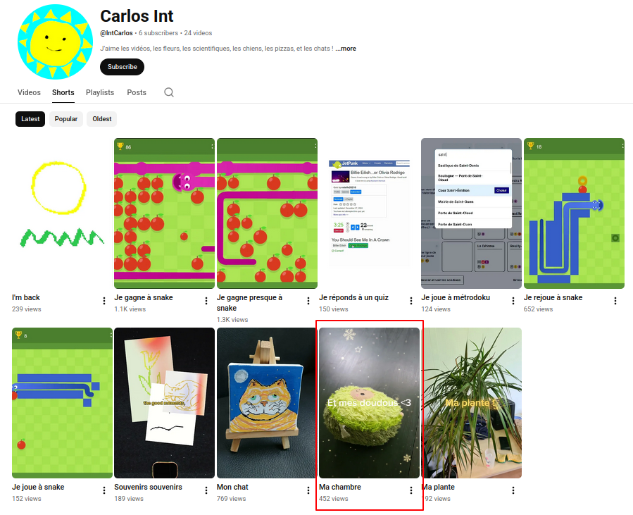
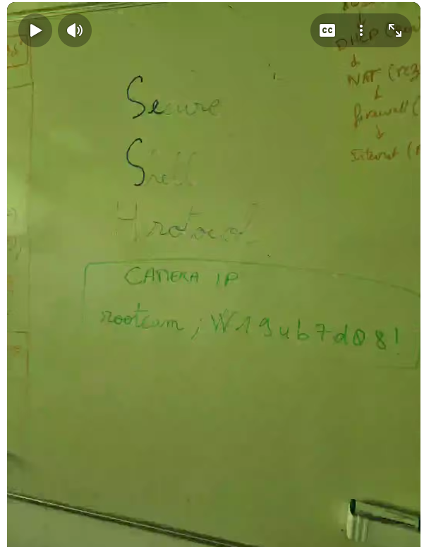
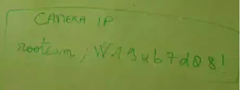
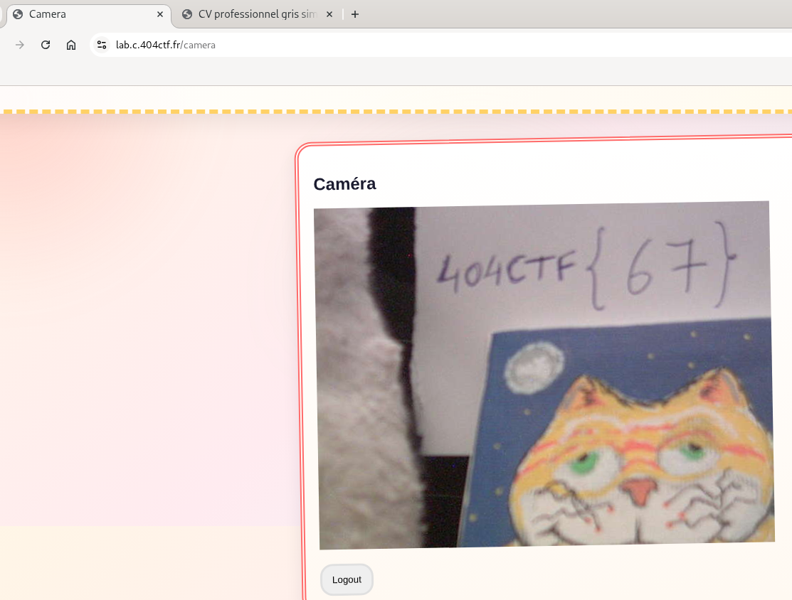
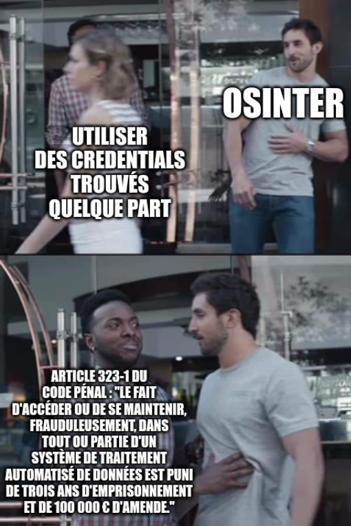

# Monsieur C : Somebody Is Watching Me

L'individu surveillé cache probablement des informations d'importance capitale chez lui.

D'après nos renseignements, il dispose d'un dispositif de surveillance à son domicile.

Encore faut-il trouver un moyen d'y accéder...

## Solution

Cliquez pour dévoiler la solution

### Pistes

* Retournons sur le site de Monsieur C.
* On trouve deux pages intéressantes :
   * [Son CV](solution/CV.pdf)
   * Un formulaire de login 
      
* D'après son CV, son nom est **Carlos Int**.
* Il mentionne par ailleurs une chaîne YouTube sur son blog : 
   
* On cherche une chaîne YouTube au nom de Carlos Int, et bingo :
   * https://www.youtube.com/@IntCarlos
* On explore un peu, et on trouve notamment des shorts, dont un qui attire notre attention : 
   
* En le visionnant, on tombe sur une image fort intéressante : 
     
   
* On distingue les identifiants suivants :
   * `rootcam`
   * `W19ub7d08!`	
* Essayons sur le formulaire de login... Bingo ! 
   

### Rappel sur la loi

Attention, ici nous sommes dans le cas d'un CTF, et donc de "faux" systèmes d'information. Dans un cadre réel, il est FORMELLEMENT interdit d'accéder à un système d'information sans autorisation. Cela constitue une infraction pénale.

Cela contrevient également à la règle d'or de l'OSINT : "Pas d'intéraction avec la cible".

### Flag

`404CTF{67}`

