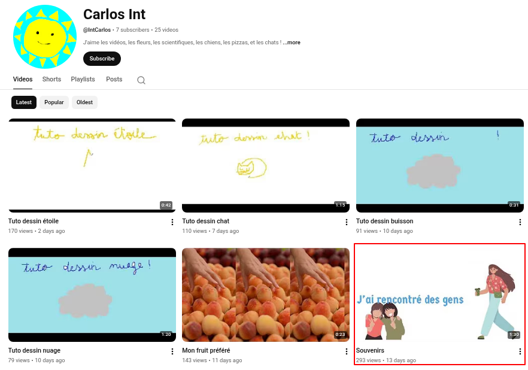
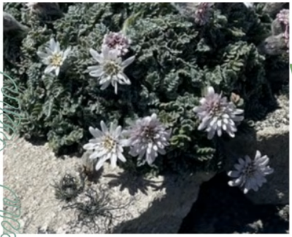

# Monsieur C : Voyage voyage

Monsieur C est récemment parti en vacances.
Il y a quelques siècles, un explorateur français s'était lui aussi rendu pour la première fois sur ce lieu, accompagné d'un naturaliste.
Comment s'appelle ce naturaliste ?

Format du flag : `404CTF{jean-jean_quete}`

## Solution

Cliquez pour dévoiler la solution

### Pistes

* Toujours sur la chaîne YT :
   * https://www.youtube.com/@IntCarlos
* On trouve notamment la vidéo suivante :
   * https://www.youtube.com/watch?v=Y-mu1x0LMZs  
   
* Celle-ci parle de vacances, on est sur la bonne piste !
* Une image retient notre attention, des fleurs : 
   
	   
	
### Fausse piste

* Un coup de google image inversé nous renvoie vers le site PlantNet :
   * [Leucheria leontopodioides (Kuntze) K.Schum.](https://identify.plantnet.org/the-plant-list/species/Leucheria%20leontopodioides%20(Kuntze)%20K.Schum./data)
* Avec une rapide recherche google, on trouve la page wikipédia de cette espèce :
   * [Leucheria leontopodioides](https://ceb.wikipedia.org/wiki/Leucheria_leontopodioides)
   * On utilise la fonctionnalité de traduction de chrome qui est bien utile ici.
* Cette plante est présente dans deux pays : **Argentine** et **Chili**.
* On cherche alors des explorateurs qui sont partis en Argentine et au Chili (il y en a beaucoup...), et on tente de nombreux naturalistes qui les accompagnent, sans succès.

### La bonne voie

* On revient sur PlantNet, qui propose d'analyser des images directement.
* On soumet le screenshot précédent, et on tombe sur une espèce différente :
   * [Leucheria suaveolens (d'Urv.) Speg.](https://identify.plantnet.org/k-world-flora/species/Leucheria%20suaveolens%20(d'Urv.)%20Speg./data)
* On trouve la [page Wikipedia associée](https://en.wikipedia.org/wiki/Leucheria_suaveolens) qui nous indique que c'est une espèce endémique (*se dit des espèces vivantes propres à un territoire bien délimité*) des [Îles Malouines](https://fr.wikipedia.org/wiki/%C3%8Eles_Malouines)
* On effectue la recherche google suivante :
   * `"Îles Malouines" explorateur français première fois naturaliste`
* On tombe directement sur [**Louis-Antoine de Bougainville**](https://fr.wikipedia.org/wiki/Louis-Antoine_de_Bougainville#Les_Malouines)
* Dont la page Wikipedia nous renvoie vers [**Antoine-Joseph Pernety**](https://fr.wikipedia.org/wiki/Antoine-Joseph_Pernety)

### Flag

`404CTF{antoine-joseph_pernety}`

