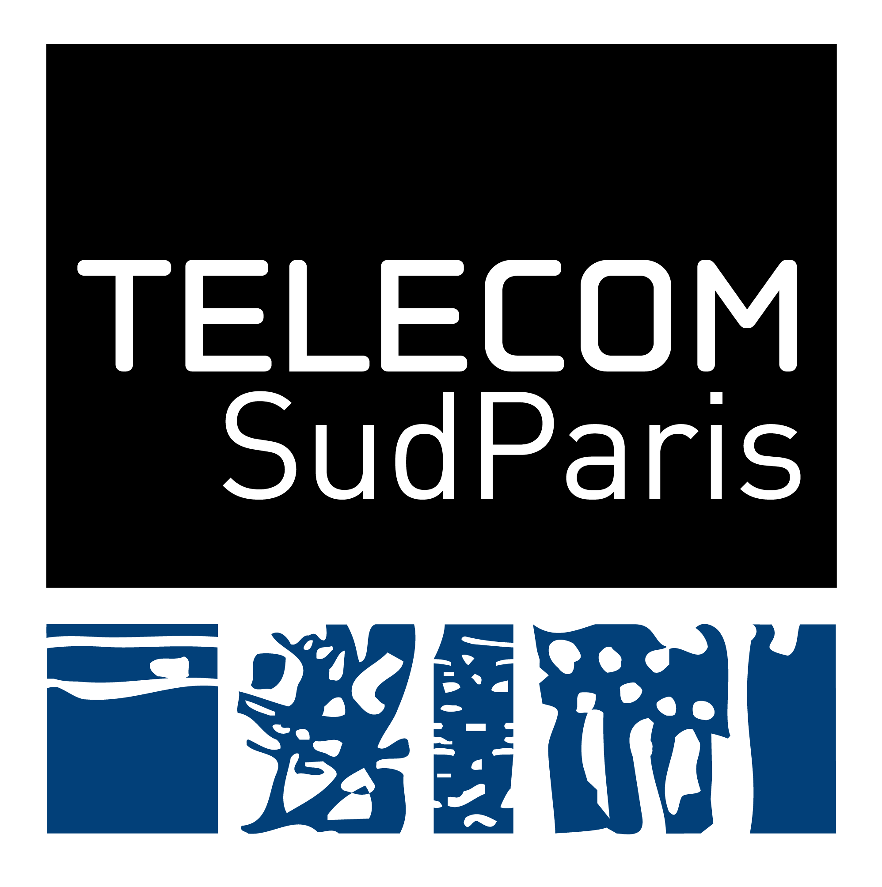
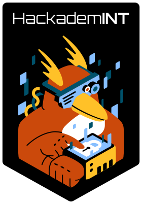
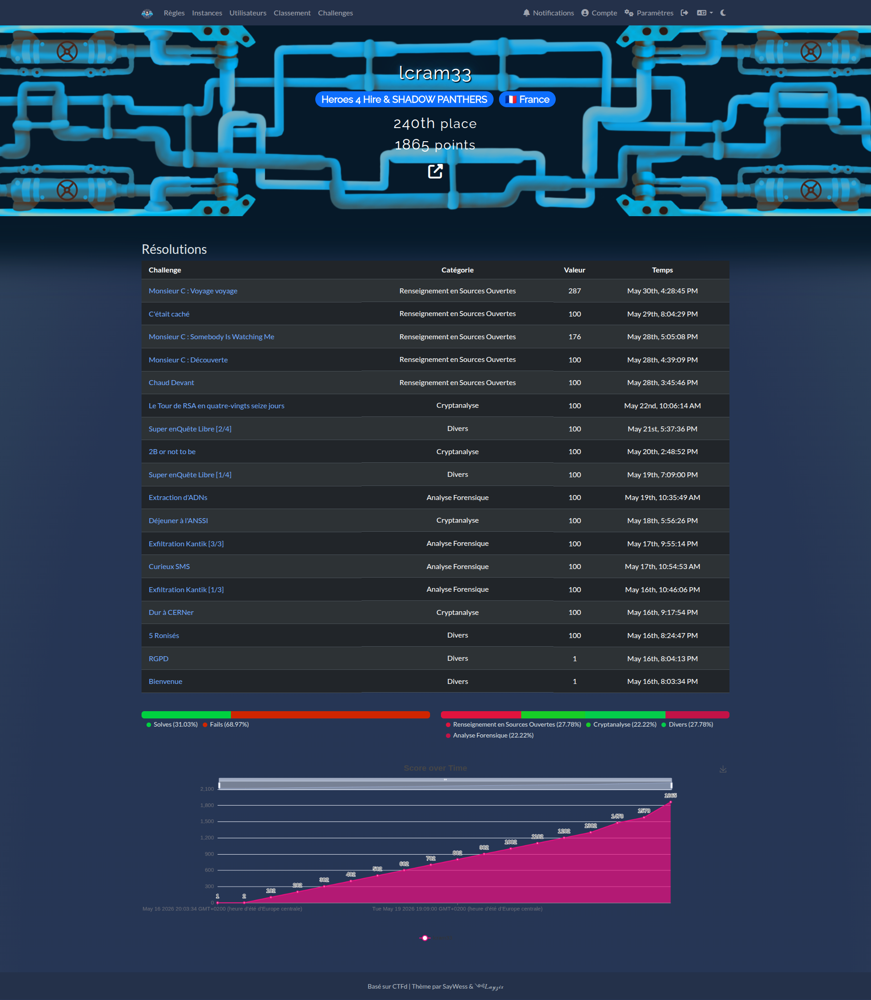

# 404 CTF 2026 - Write Ups

    

Mes writeups pour le 404 CTF édition 2026 en tant que participant.

> [!TIP]
> For the English speaking community, this is a writeup of the 404 CTF 2026, a French cybersecurity competition. The content is in French, but my code and comments are most of the time in English. The file listed under "Fichiers du challenge" are the original, unmodified challenge files, whereas the solution files are clearly separated.

## L'événement

 
  
  &nbsp;&nbsp;
  
  &nbsp;&nbsp;
  

16/05/2026 - 07/06/2026

> Coorganisé par la Direction Générale de la Sécurité Extérieure et Télécom SudParis, le 404 CTF est la plus grande compétition de cybersécurité de France. Après le succès des années précédentes, le 404 CTF revient pour une cinquième édition mettant à l'honneur les grands ingénieurs et scientifiques français !
>
> Pendant trois semaines, confrontez-vous à des challenges conçus par le club de cybersécurité HackademINT de Télécom SudParis. Que vous soyez expert ou débutant, n'hésitez pas à mettre vos compétences à l’épreuve lors de ce CTF individuel !

https://404ctf.fr/

## Politique autour de l'utilisation des LLM

>[!WARNING]
> Cette compétition a une clause stricte quant à l'utilisation des LLM (Large Language Models) et MCP. 
> **TL;DR** : l'utilisation de LLM pour résoudre automatiquement les épreuves est **strictement interdite**. Seule son utilisation comme simple moteur de recherche ou comme aide au développement est tolérée.

Détails

> **L'utilisation de LLM pour résoudre automatiquement les épreuves est strictement interdite.** 
> Seule son utilisation comme simple moteur de recherche ou comme aide au développement est tolérée. 
> Par exemple, les participants sont autorisés à poser les mêmes questions à un LLM que celles qu'ils poseraient à un moteur de recherche.
>
> Liste non exhaustive de choses **interdites** :
> * Demander à un LLM ou agent de résoudre automatiquement une épreuve.
> * Rechercher des vulnérabilités dans du code source.
> * Utiliser des serveurs MCP pour aider à la résolution (Ghidra, IDA, etc.)
> * Générer du code à l'aide d'un prompt LLM.
>
> Liste non exhaustive de choses **autorisées** :
> * Faire une recherche bibliographique.
> * Rechercher des constantes que vous avez trouvées dans un binaire.
> * Demander pourquoi une erreur survient.
> * Utiliser des outils d'assistance à l'édition de code intégrés dans un IDE.

>[!NOTE]
> J'ai respecté cette clause pour la résolution de l'ensemble des challenges. A titre de transparence, mes différents cas d'usages sont ci-dessous.

Mes cas d'usages de LLM pour ce CTF

* VSCode + Copilot : pour l'accélération de la rédaction de code et des WU (markdown).
  * Sans complétion de fonctions / portions entières, conception à la main.
* Utilisation de différents modèles de LLM :
  * Procédures d'installation d'outils / plugins, configurations, etc.
  * Recherches diverses, que l'on peut effectuer sur un moteur de recherche classique.
  * Demandes d'explications en détails de concepts, d'erreurs, etc.
* De façon plus générale : je n'ai pas "trahis" la philosophie des CTF, à savoir se casser la tête sur des problèmes, passer des heures la tête plongée dans de la documentation, des papiers de recherches, articles de blogs, etc., le tout afin d'apprendre de nouvelles compétences / acquérir de nouvelles connaissances. Mes WUs en sont la preuve !

## Code couleur

⚪️ Intro 
🟢 Facile 
🔵 Moyen 
🔴 Difficile 
⚫️ Extrême 

## Challenges

### Divers

⚪️ [5 Ronisés](Divers/5Ronises/) 
⚪️ [Super enQuête Libre [1/4]](Divers/SuperEnQueteLibre1/) 
🟢 [Super enQuête Libre [2/4]](Divers/SuperEnQueteLibre2/)

### Analyse Forensique

🟢 [Curieux SMS](AnalyseForensique/CurieuxSMS/) 
🟢 [Extraction d'ADNs](AnalyseForensique/ExtractiondADNs/) 
🟢 [Exfiltration Kantik [1/3]](AnalyseForensique/ExfiltrationKantik1/) 
🔵 [Exfiltration Kantik [3/3]](AnalyseForensique/ExfiltrationKantik3/)

#### Non résolu

🔵 [Exfiltration Kantik [2/3]](AnalyseForensique/ExfiltrationKantik2/) : publié pour les instructions d'installation de volatility3 avec ses symboles dans le cadre de ce challenge

### Cryptanalyse

⚪️ [Dur à CERNer](Cryptanalyse/DurACERNer/) 
🟢 [Déjeuner à l'ANSSI](Cryptanalyse/DejeunerANSSI/) 
🟢 [2B or not to be](Cryptanalyse/2BOrNotToBe/) 
🟢 [Le Tour de RSA en quatre-vingts seize jours](Cryptanalyse/LeTourDeRSAEn96J/)

### Renseignement en Sources Ouvertes (OSINT)

* Pour cette catégorie, j'ai utilisé  <a href="https://www.giuspen.com/cherrytree/">CherryTree</a> pour organiser mes recherches.
* Le fichier [OSINT-404CTF.ctb](OSINT/OSINT-404CTF.ctd) contient les énoncés (noeuds) et les sous-noeuds contiennent des pistes ou solutions. Ils sont bien identifiés (pour écarter tout risque de spoil).
* Les challenges seront plus tard rédigés dans des fichiers markdown dédiés, quand je prendrais le temps de les migrer.

⚪️ [Chaud Devant](OSINT/) 
🟢 [C'était caché](OSINT/CetaitCache/) 
⚪️ [Monsieur C : Découverte](OSINT/) 
🔵 [Monsieur C : Somebody Is Watching Me](OSINT/) 
🔵 [Monsieur C : Voyage voyage](OSINT/)

## Scoreboard

### Classement au 31/05

Je n'ai pu participer au CTF que jusqu'au **31/05** soir, soit les 2/3 du temps imparti.
A 23h00 au 31/05, mon classement était le suivant :

| Rang | Points |
|------|--------|
| **240e** | 1865   |

Fichier json de CTFd pour le scoreboard (au 31/05, 23h00) : [scoreboard-31-05.json](scoreboard/scoreboard-31-05.json)

Profil utilisateur au 31/05

### Classement final

*Sera complété plus tard, une fois le classement final publié et dès que j'aurai le temps de mettre à jour ce repo.*

| Rang | Points |
|------|--------|
| XXe  | XXXX   |

<!-- TODO /api/v1/scoreboard -->
Fichier json de CTFd pour le scoreboard (post CTF) : [scoreboard.json](scoreboard/scoreboard.json)